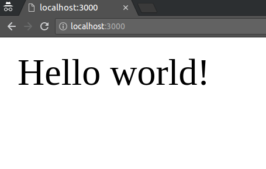

# Занятие 5

## План занятия

### Http-протокол  
 **положение на модели OSI**
 - текстовый/бинарный (1.*, 2.*)  -
 - структура  
 - глаголы
 - статусы  
 - просмотр через devTools или postman

### Что такое http-сервер  
 - модуль http  
 - открытие порта  
 - отдача ответа  

### Express

#### Установка и настройка окружения

Убедитесь в том, ч то у вас установлены npm и NodeJS версии не ниже 8.11.3 - именно она будет использоваться в этом курсе.

В произвольном месте создайте каталог для нашего проекта и перейдите в него с помощью командной строки или терминала.

Теперь необходимо создать файл package.json, который будет хранить всю информацию о нашем приложении и о его зависимостях. Для этого в консоли выполните команду:

```js
npm init
```
На вопросы визарда npm init в данном случае можно отвечать произвольно, но в качестве entry point рекомендую указать "app.js".

Установим Express и Nodemon:

```js
npm i express --save
npm i nodemon -g
```
Nodemon - это утилита, которая отслеживает изменения в исходном коде и автоматически перезагружает приложение.
В рабочем каталоге создайте файл конфигурации Nodemon с именем nodemon.json и следующим содержимым:
```js
{
  "restartable": "rs",
  "ignore": [
    ".git",
    "node_modules/**/node_modules"
  ],
  "verbose": true,
  "env": {
    "NODE_ENV": "development"
  }
}
```
Более подробно с настройкой и возможностями Nodemon можно ознакомится [здесь](https://github.com/remy/nodemon).

Создайте файл app.js в нашем рабочем каталоге и скопируйте в него следующий код:

```js
'use strict';

const express = require('express');
const app = express();

const port = 3000;

app.get('/', (req, res) => {
  res.send('Hello world!');
});

app.listen(port, () => {
  console.log(`Express is listening on port ${port}`);
});
```

Затем выполните команду:
```js
nodemon app.js
```

В консоли вы увидите примерно следующее:
```js
$ nodemon app.js
[nodemon] 1.18.3
[nodemon] reading config ./nodemon.json
[nodemon] to restart at any time, enter `rs`
[nodemon] or send SIGHUP to 25871 to restart
[nodemon] ignoring: .git node_modules/**/node_modules
[nodemon] watching: *.*
[nodemon] watching extensions: js,mjs,json
[nodemon] starting `node app.js`
[nodemon] forking
[nodemon] child pid: 25883
[nodemon] watching 4 files
Express is listening on port 3000
```
Это означает, что наше приложение успешно запущено и Express слушает указанный порт, в нашем случае это 3000.
Теперь, если в браузере перейти по адресу localhost:3000, то в окне браузера мы увидим:



Теперь подробно разберем что происходит в файле app.js:
```js
'use strict'; //используем "строгий" режим

const express = require('express');
const app = express(); // происходит создание приложения

const port = 3000; // номер tcp порта

/**
 * Создаем маршрут (route), который на все GET запросы к корневому URL (/) отвечает текстом "Hello World!". Т.к. другие маршруты на данный момент не описаны, то на все остальные маршруты приложение будет отвечать кодом 404.
 */
app.get('/', (req, res) => {
  res.send('Hello world!');
});

// Запуск HTTP-сервера на 3000-м порту
app.listen(port, () => {
  console.log(`Express is listening on port ${port}`);
});
```
Коротко, можно выделить 4 стадии происходящего:
1. Создание нового приложения Express
2. Создание нового маршрута
3. Запуск HTTP-сервера
4. Обработка поступающих на наш HTTP-сервер запросов

### Маршрутизация

Маршрутизация — механизм, с помощью которого запросы (в соответствии
с заданными URL и методом HTTP) находят путь к обрабатывающему их коду. 


### Промежуточное ПО (Middleware)
 -

### Шаблонизаторы
 -

## Домашнее задание
 - Добавить в проект возможность авторизации/регистрации  
 - Должна быть проверка входящих данных (валидный email, пароль минимальной длины с наличием спец-символов)  
 - Загрузка файлов (аватар пользователя, обложка кинофильма, аудиозапись, ...)  